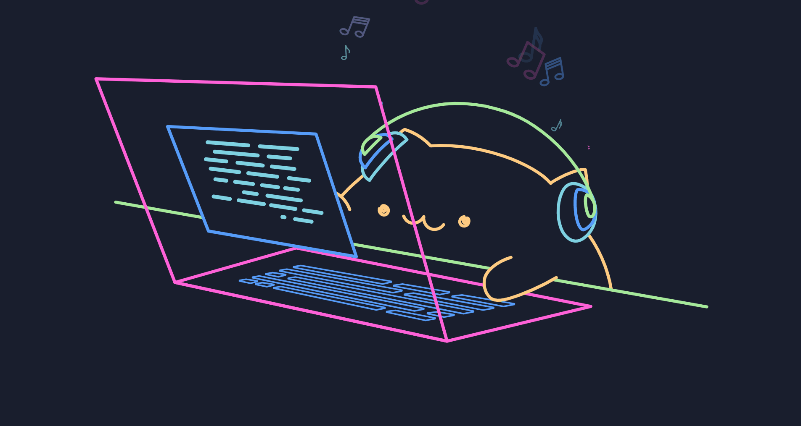

  <h3>Chih Yu :3</h3>
  
<samp>Software Engineer | Cat Lover | Custom Keyboard Enthusiast</samp>

  <h6><i>Currently learning iOS development with Swift and SwiftUI</i></h6>

🐈・⌨️・☕・🐈・⌨️・☕・🐈・⌨️・☕・🐈・⌨️・☕・🐈・⌨️・☕・🐈・⌨️・☕・🐈・⌨️・☕

  

    <strong><em>
      ┏━━━━━━━━━━━━━━━━━━━━━━━━━━━━━━━━━━━━━━┓ 
       Check out <a href="https://uhcakip.github.io/" target="_blank">chihyu.codes</a> for more about me!  
      ┗━━━━━━━━━━━━━━━━━━━━━━━━━━━━━━━━━━━━━━┛
    </em></strong>
  

  

  
🐾 Powered by code, coffee, cats, and custom keyboards 🐾

